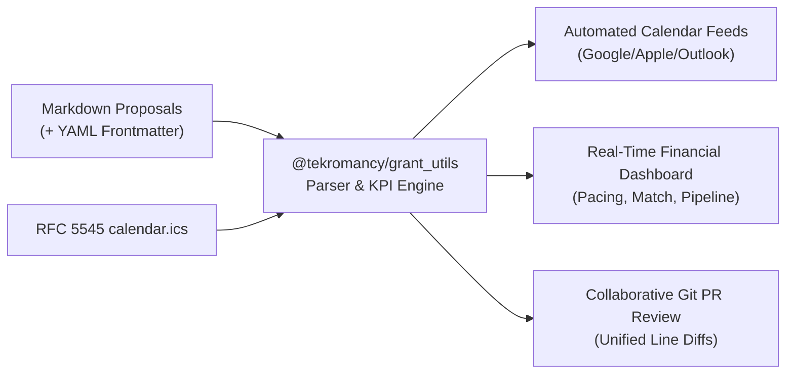

# Grantwriting Utils Monorepo (`grant_utils`)

> The open-source infrastructure and toolkit for Git-powered grantwriting, pipeline tracking, cost-share accounting, RFC 5545 iCalendar synchronization, and collaborative PR review.

[](https://github.com/Tekromancy/grant_utils/actions/workflows/ci.yml)
[](https://www.npmjs.com/package/@tekromancy/grant_utils)
[](https://opensource.org/licenses/MIT)
[](https://pnpm.io/)

---

## 🏛️ Monorepo Architecture

This monorepo houses the core `@tekromancy/grant_utils` TypeScript engine, end-to-end documentation, and a fully functional reference application demonstrating how any organization, cooperative, or non-profit can structure their own grantwriting repository.

```
grant_utils/
├── packages/
│   └── grant_utils/            # Core library (@tekromancy/grant_utils)
│       ├── src/                # Models, parsers, KPI engines, diff calculators
│       ├── scripts/            # Code-generation scripts (grants, calendar, docs)
│       ├── tests/              # Vitest test suite
│       └── package.json
├── examples/
│   └── sample-grant-hub/       # Complete reference grantwriting repository
│       ├── data/               # Markdown proposals with YAML frontmatter
│       ├── calendar.ics        # Master RFC 5545 calendar feed
│       ├── strategic_plan.md   # Organizational targets & priorities
│       ├── src/index.ts        # Interactive demo CLI
│       └── tests/              # Integration tests
├── docs/                       # Complete guide & specifications
│   ├── setup-guide.md          # 15-minute guide to setting up your own repo
│   ├── frontmatter-spec.md     # Proposal metadata standard
│   ├── calendar-spec.md        # RFC 5545 calendar integration standard
│   └── npm-publishing.md       # Release and publishing workflow
└── .github/workflows/          # CI/CD and automated npm publishing
```

---

## 🚀 Quick Start: Building & Testing the Monorepo

Prerequisites:
- [Node.js](https://nodejs.org/) (v20+ recommended, v24 supported)
- [pnpm](https://pnpm.io/) (v9+)

```bash
# 1. Clone the repository
git clone git@github.com:Tekromancy/grant_utils.git
cd grant_utils

# 2. Install dependencies across all packages
pnpm install

# 3. Build the core library and example application
pnpm run build

# 4. Run test suites across the monorepo
pnpm run test

# 5. Execute the sample grant hub demo CLI
pnpm run example
```

---

## 📦 Packages in this Monorepo

| Package | Directory | Description | Status |
| :--- | :--- | :--- | :--- |
| **`@tekromancy/grant_utils`** | [`packages/grant_utils`](./packages/grant_utils) | Core computational engine, YAML parser, RFC 5545 calendar generator, KPI aggregator, unified diff, and Git PR tooling. | [](https://www.npmjs.com/package/@tekromancy/grant_utils) |
| **`sample-grant-hub`** | [`examples/sample-grant-hub`](./examples/sample-grant-hub) | Full reference implementation showcasing how to consume the library, manage a \$750k pipeline, and validate grants. | Reference |

---

## 🎯 What Problem Does This Solve?

Traditional grantwriting workflows suffer from:
1. **Scattered Documents:** Proposals locked in proprietary document suites, leading to version drift and lost edits.
2. **Untracked Deadlines:** Submissions missed because dates are buried in email threads rather than subscribed calendar feeds.
3. **Manual Financial Aggregation:** Spreadsheet errors calculating pipeline totals, win rates, and match funding (cost-share) requirements.
4. **Opaque Review Processes:** Stakeholder comments and edits made without clean visual diffs or audit trails.

### The Git-First Grantwriting Solution:


---

## 💡 How to Set Up Your Own Grantwriting Hub

Setting up a repository for your organization takes less than 15 minutes:

### 1. Initialize your project
```bash
mkdir my-org-grantwriting && cd my-org-grantwriting
git init -b main
pnpm init
pnpm add @tekromancy/grant_utils
```

### 2. Create your folder structure
```bash
mkdir -p data/grants
```

### 3. Author a proposal (`data/grants/01_example_grant.md`)
```markdown
---
id: usda_sdgg_2027
title: "USDA Socially Disadvantaged Groups Grant"
funder: "USDA Rural Development"
amount: 175000
amountFormatted: "$175,000"
deadline: "2027-06-15"
deadlineFormatted: "June 15, 2027"
matchPercentage: 0
portalUrl: "https://grants.gov"
status: "Drafting"
---

# Project Narrative & Line-Item Budget...
```

### 4. Consume in your code
```typescript
import { parseGrantMarkdown, calculateTotalPipeline } from '@tekromancy/grant_utils';
import { readLocalMarkdownFile } from '@tekromancy/grant_utils/node';

const raw = readLocalMarkdownFile(process.cwd(), 'data/grants/01_example_grant.md');
const { metadata } = parseGrantMarkdown(raw);

console.log(`Grant: ${metadata.title} | Amount: ${metadata.amountFormatted}`);
```

👉 **Read the full tutorial in [docs/setup-guide.md](./docs/setup-guide.md).**

---

## 📖 Complete Documentation Index

- **[Architecture & Setup Guide](./docs/setup-guide.md)**: End-to-end tutorial covering directory structure, authoring proposals, calendar synchronization, and CI/CD.
- **[YAML Frontmatter Specification](./docs/frontmatter-spec.md)**: Formal schema for proposal metadata, match percentages, funding tiers, and lifecycle statuses.
- **[RFC 5545 iCalendar Specification](./docs/calendar-spec.md)**: Complete guide to calendar feed fields, alarms, and multi-client subscription instructions.
- **[NPM Publishing & Release Guide](./docs/npm-publishing.md)**: Automated CI/CD release workflow via GitHub Actions and npm provenance.

---

## 🧪 Testing & Verification

The monorepo contains comprehensive unit and integration test coverage:
```bash
# Run all tests
pnpm run test

# Run tests in watch mode during development
pnpm --filter @tekromancy/grant_utils test:watch
```

Tests cover:
- YAML frontmatter parser edge cases and unicode handling.
- RFC 5545 iCalendar feed generator and VEVENT parser.
- Financial arithmetic, match funding calculations, and deadline pacing.
- Unified line diff engine.
- Git branch name and PR body formatting.

---

## 🚢 Publishing to NPM

Automated publishing is configured in [`.github/workflows/publish.yml`](./.github/workflows/publish.yml).

To release a new version:
1. Bump the version in `packages/grant_utils/package.json`.
2. Push changes to `main`.
3. Create and push a git tag:
   ```bash
   git tag v0.1.1
   git push origin v0.1.1
   ```
4. GitHub Actions will run tests, build the package, and publish to npm with `--access public`.

---

## 🤝 Contributing & Community

Contributions are welcomed from non-profits, cooperatives, open-source maintainers, and grant professionals.
- File issues and feature suggestions in [GitHub Issues](https://github.com/Tekromancy/grant_utils/issues).
- Submit pull requests following standard Git feature-branch workflows.

---

## 📄 License

Released under the [MIT License](./LICENSE).  
Copyright © 2026 [Tekromancy](https://github.com/Tekromancy) & [Austin Cooperative Business Foundation](https://github.com/AustinCooperativeBusinessFoundation).
